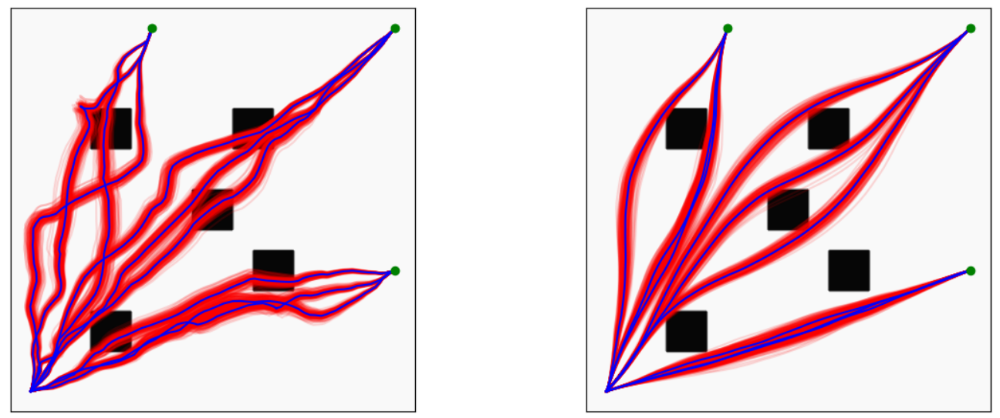

# stoch_gpmp

This library implements Stochastic Gaussian Process Motion Planning algorithm in PyTorch. In Imitation Learning, we use this planner to sample trajectories from the learned Energy-Based Models encoding expert trajectories.

[[Website]](https://sites.google.com/view/implicit-priors/home)      [[IROS'22 paper]](https://www.ias.informatik.tu-darmstadt.de/uploads/Team/AnThaiLe/iros2022_ebmtrajopt.pdf)



## Installation

Create a conda environment
```azure
conda env create -f environment.yml
```
Activate the environment and install the library
```azure
conda activate planning_env && pip install -e .
```

Or simply just (and install PyTorch separately)
```azure
pip install -e .
```

Additionally, please install `https://github.com/anindex/torch_robotics`.

## Examples

Try planning in planar environment with multiple goals
```azure
python examples/planar_environment.py
```

Try planning in Panda environment with multiple obstacles
```azure
python examples/panda_environment_stochgpmp.py
```

## Troubleshootings

If you encounter the exception regarding Positive-Definite matrix while initializing MP Priors, try to use higher precision floating point, e.g. `torch.float64`.

## References

[1] Urain, J.* ; Le, A.T.* ; Lambert, A.*; Chalvatzaki, G.; Boots, B.; Peters, J. (2022). Learning Implicit Priors for Motion Optimization, IEEE/RSJ International Conference on Intelligent Robots and Systems (IROS).  

If you use this planner, please cite us as below :-)
```
@inproceedings{iros2022_ebmtrajopt,
  author =		 "Urain, J. and  Le, A.T. and  Lambert, A. and  Chalvatzaki, G. and  Boots, B. and  Peters, J.",
  year =		 "2022",
  title =		 "Learning Implicit Priors for Motion Optimization",
  booktitle =		 "IEEE/RSJ International Conference on Intelligent Robots and Systems (IROS)",
  key =			 "motion planning, energy-based models",
  URL =			 "https://www.ias.informatik.tu-darmstadt.de/uploads/Team/AnThaiLe/iros2022_ebmtrajopt.pdf",
  crossref =		 "p11531"
}
```

### Contact

If you have any questions or find any bugs, please let me know: [An Le](https://www.ias.informatik.tu-darmstadt.de/Team/AnThaiLe) an[at]robot-learning[dot]de
